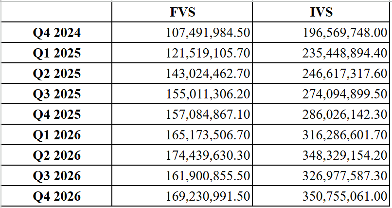

# 🏛️ Votable Supply (FVS) and Ideal Votable Supply (IVS) Forecasting  

  

## 📌 Overview  

This repository contains data, models, and methodologies for forecasting **Votable Supply (VS)** and **Ideal Votable Supply (IVS)** in the Optimism ecosystem. The project utilizes historical governance and tokenomics data to build predictive models using various machine learning techniques. The primary goal is to estimate future votable supply trends and derive an ideal votable supply.  

---

## 📂 Repository Structure  

The repository is structured into several key directories, each serving a specific purpose:  

### 📊 Dataset/  
Contains all historical and predicted data used for forecasting votable supply and its related parameters.  

- **Historical_Data/**: Stores raw and processed historical data for key metrics such as liquidity activity ratio (LAR), actual voting power index (AVPI), OP price, participation ratio (PR), circulating supply (CS), and votable supply (VS).  
- **Prediction_Data/**: Contains forecasted values for various parameters used in predicting votable supply and Ideal votable supply.  
- **Future_Votable_Supply/**: Includes day-wise votable supply predictions.  
- **Future_Circulating_Supply/**: Stores calculated future circulating supply data.  
- **Ideal_Votable_Supply_Data/**: Contains comprehensive datasets for IVS calculations, including historical and forecasted values, weight combinations, and final IVS predictions.  

---

### 🧠 Models_and_Scripts/  
This directory houses machine-learning models and scripts used for data processing, prediction, and IVS calculations.  

- **Parameters_Prediction/**: Contains individual parameter forecasting scripts (Liquidity Activity Ratio, Actual Voting Power Index, OP Price, and Participation Ratio).  
- **Future_Votable_Supply/**: Implements the main votable supply forecasting model.  
- **Ideal_Votable_Supply_Scripts/**: Step-by-step scripts for calculating and validating the ideal votable supply.  

---

### 🔍 LLM-Approach/  
This section explores how Large Language Models (LLMs) can assist in token governance insights and votable supply forecasting.  

- **Docs/**: Collection of research insights generated using LLMs.  
- **Only LLM/**: Pure LLM-based insights without additional data integration.  
- **Votable-supply-data-forecasting/**: LLM-powered forecasting models for votable supply and its components.  
- **With SARIMA/**: Forecasting using SARIMA models alongside LLM-based analysis.  

---

### 📑 Reports/  
This directory contains various research reports related to votable supply forecasting and Ideal votable supply calculation and forecasting.  

- **1️⃣ Step-by-Step Execution Workflow for Calculating Ideal Votable Supply (IVS) 📄**  
  Outlines the execution process for calculating IVS step by step.  

- **2️⃣ Methodology for Calculating and Predicting Ideal Votable Supply 📄**  
  Explains the approach taken to calculate and predict votable supply.  

- **3️⃣ Methodology for Predicting Future Votable Supply (FVS) 📄**  
  Details the methodology used to forecast future votable supply.  

- **4️⃣ Votable Supply Prediction Using LLM 🤖**  
  Covers the approach of using Large Language Models (LLMs) for votable supply prediction.  

- **5️⃣ Predicting Future Votable Supply: Machine Learning Approaches and Results 📊**  
  Compares multiple ML models used for prediction and presents their results.

---

## 📈 Key Findings  
Our forecasting models predict votable supply trends and provide an ideal voting power distribution. The results contribute to governance efficiency by estimating voting power concentration and proposing a balanced distribution approach.  

🖼 **Quarterly VS (Votable Supply) and IVS (Ideal Votable Supply) Forecast**  

---

## 📚 Project Resources & Documentation  
For a detailed understanding of the methodologies, data sources, and execution processes used in this project, refer to the **Project Resources & Documentation** file. It contains:  

- Detailed explanations of methodologies and models  
- Data sources and preprocessing steps  
- Execution workflows and analysis techniques  
- Additional research insights  

📑 **<a href="Reports/DIVS Final Report.pdf" target="_blank">DIVS Final Report</a>** – A comprehensive report detailing the methodology, findings, and implications of the Decentralized Ideal Votable Supply (DIVS) model.

📖 **[Read the full Project Resources & Documentation](./Runbook_Documentation.md)**  

---

