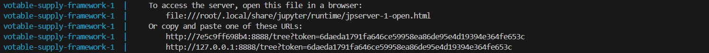
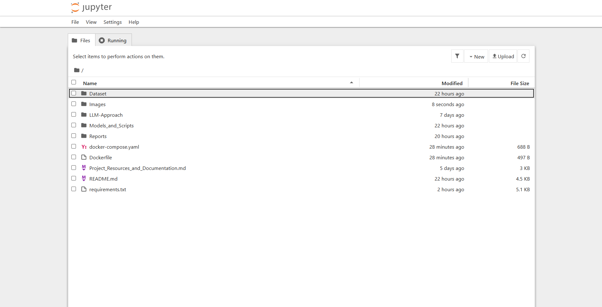

# Docker Setup for Votable Supply Framework

This guide provides step-by-step instructions for setting up and running the **Votable Supply Framework** using Docker. With this setup, you can run the framework in an isolated environment without needing to manually install dependencies.

---

## 🚀 **Why Use Docker?**
- No need to install Python or dependencies manually.
- Ensures a consistent development environment across all machines.
- Runs in an isolated container, preventing conflicts with other projects.
- Easy setup and teardown with a single command.

---

## 🛠 **Prerequisites**
Before proceeding, ensure you have the following installed:

- [Docker](https://docs.docker.com/get-docker/) (for running containers)
- [Docker Compose](https://docs.docker.com/compose/install/) (for managing multi-container applications)

To verify installation, run:

```bash
docker --version
docker-compose --version
```

---

## 📦 **Setting Up the Dockerized Environment**

### 1️⃣ Clone the Repository
First, clone the project repository:

```bash
git clone https://github.com/ARDev097/Votable-Supply-Framework.git
cd Votable-Supply-Framework
```

### 2️⃣ Build the Docker Image
Run the following command to build the Docker image for the framework:

```bash
docker-compose build
```

This may take a few minutes as it installs all necessary dependencies.

### 3️⃣ Start the Jupyter Notebook Server
Run the following command to launch the container and start Jupyter Notebook:

```bash
docker-compose up
```

### 4️⃣ Access the Jupyter Notebook Server
After running the previous command, you will see a URL link in the terminal indicating where the Jupyter Notebook server is hosted (e.g., `http://127.0.0.1:8888`). Open this URL in your browser to access the Jupyter Notebook.



This will start the Jupyter Notebook server inside the container.

---

### 5️⃣ Jupyter Notebook Interface
Once the Jupyter Notebook interface opens, you will see a directory structure that contains all the available scripts and analysis notebooks.



---

### 6️⃣ Running the Analysis
To run the analysis, follow the instructions in the [analysis README documentation](Runbook.md). This documentation provides a detailed guide on which scripts to run, the purpose of each, and the steps to perform the analysis.

- If you need to adjust any settings within the scripts, you can do so in the `config.yaml` file located in each folder. This file contains the configuration settings for the respective scripts, allowing you to modify parameters as needed for your analysis.

---

Happy coding! 🚀
